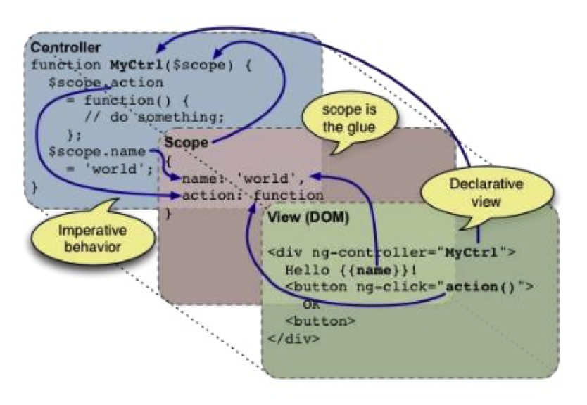

חזרה ל[עמוד ראשי](../../..)

# שיעורי בית 2 - פיתוח צד לקוח בסיסי עם Angular

### מטרות
- היכרות עם סביבת Angularjs

### הרכב הציון
- השלמת המשימה בזמן

### הגשה
- באמצעות העלאת הקוד למאגר חדש, פתיחת כרטיס (issue) במערכת המשימות של המאגר ושיוכו למתרגלת
- בכותרת הכרטיס יש לציין את המשימה hw2-wireframing-angular-submission
- ובפרטי הכרטיס יש לתת קישור למאגר הקוד
- ההגשה עד לתאריך: 30/11/2016 23:59

---

### AngularJS - רקע
בפיתוח צד לקוח נעשה שימוש בטכנולוגיית AngularJS של חברת גוגל, AngularJS הינה JavaScript framework המשתמשת בארכיטקטורת MVC (Model – View - Controller).
* (Model (Data – הנתונים של האפליקציה
* (View (UI – המסכים של האפליקציה, מה שהמשתמש רואה (Html)
* (Controller (Logic – הלוגיקה של האפליקציה, בקר בין התצוגה לנתונים AngularJS, אחראי על ניהול המצבים השונים של ממשק המשתמש (UI), האינטראקציה מול Expressjs server וסנכרון הנתונים.

##  כמה מהתכונות הבולטות ב-AngularJS הן:
* Two-way data binding- מסנכרן בין הנתונים לתצוגה ע”י הוספת attributes בתגיות ה-HTML (הנקראים Directives), מי שבעצם מחבר בין שני החלקים ומקשר ביניהם הוא כלי עזר בשם scope.
* Single Page Application - אפשרות לפיתוח אפליקציית web אשר מתאימה לעמוד אינטרנטי אחד, במטרה לספק זרימה שוטפת יותר של חווית ממשק משתמש (UX). בעצם, כל הקוד מצוי כבר בתוך טעינת הדף ב- client, או שהמשאבים המתאימים מוטענים בצורה דינאמית ומתווספים לדף על פי הצורך (הדף אינו נטען מחדש בשום שלב בתהליך).
באתר של AngularJS, ניתן למצוא את כל הדוקומנטציה, התקנה ודוגמאות: [angularjs](https://angularjs.org) .

##  איך זה עובד?
הלוגיקה של האפליקציה נמצאת בתוך קובץ js ראשי, בו ניצור Module. ה- Module הינו הייצוג המרכזי של האפליקציה שלנו, בו אנו מגדירים את תכונות האפליקציה ואת התנהגותה.
הגדרה של Module:
var "myApp"= angular.module("myApp", []);
קשר ה- Module ל- view הרצוי בעזרת התגית ng-app, לדוגמה:
<html ng-app="myApp">
ה- Controller הינו פונקציית js המשתמש כבקר בין ה-view (התצוגה) ל-model (הנתונים), לדוגמה:

## Angular Routing
נוסף לקוד ספריית ה-angular.js, נכלול את קוד המודול האנגולרי angular-route.js שמספק את הראוטר (נתב בעברית), שמאפשר להחליף את תוכן הדף בתגובה לשינוי ה-url.

הראוטר, שמחליף את התוכן לפי ה-url , פועל בתוך המתודה config באמצעות האובייקט routeProvider$.

המתודה when מקבלת בתור פרמטר ראשון את ה- url (כמו כן, ניתן להגדיר ב-url  את הפרמטר שאנחנו רוצים להעביר לקונטרולר) ואחר כך אובייקט שכולל את הטמפלייט ואת הקונטרולר.

## התחלת התרגיל 
כל סטודנט נדרש להכין 3 מסכים (קוד, דפי HTML, CSS, JS כיוצ”ב ולא Mockup), המסכים נדרשים להיות מקושרים ביניהם (ניתן יהיה לבצע מעבר בין הדפים) באמצעות AngularJS בסיסי.
הדף הראשי (home) יכיל Navigation Menu לדוגמה:

בלחיצה על כל טאב בתפריט תציג תוכן שונה באמצעות AngularJS Routing (ngRoute module)
רמז: נדרש להגדיר ברשימת התלויות של ה-Module הראשי את המודול ngRoute.
