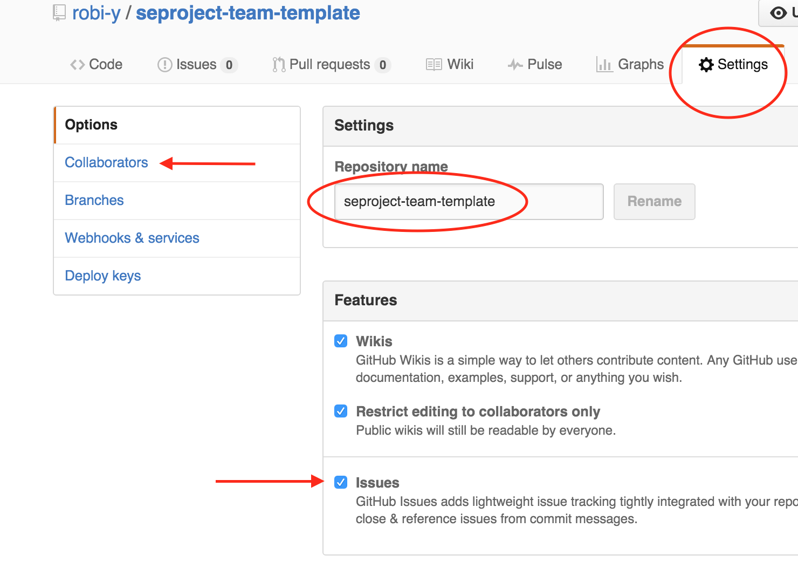

חזרה ל[עמוד ראשי](../../../../..)

# פרויקט 2 – אתחול פרויקט - Software Project Inception

### מטרות
- אתחול הפרויקט ע"י גיבוש הצוות
- עיבוד נוסף של הצעת הפרויקט
- תכנון ראשוני להמשך העבודה
- הקמת עמוד מוצר בסיסי ברשת

### הרכב הציון
ציון: יינתן על פי השלמת הפרטים השונים שלהלן ובהתאם לאיכותם, בשלב זה אין צורך בפירוט רב.
**דגשים**: קישורים מתאימים, שונות הצוות, ניתוח סיכונים.

## מבוא

מקומה של המשימה בתהליך הפיתוח: התוכן שתכתבו/תתעדו במשימה זו (לעיתים מרוכז במסמך כדוגמת Software Development Plan), משתמש גם בתוצרי השלב הקודם (רעיון\הצעת פרויקט) וישמש הלאה לתכנון, הערכה וניהול של הפרויקט. הנחות עיקריות שישפיעו על הפרויקט צריכות להיות מתועדות בו. ייתכן שחלק מהפרטים עדיין לא ידועים ולכן הוא או חלקים שלו אמורים להתעדכן ולהתפתח תוך כדי מחזור החיים של הפרויקט.
בפרויקט שלכם המשימה תתבצע באמצעות מערכת מקובלת לניהול פרויקט תוכנה. לתיעוד נשתמש באתר ויקי, זאת על מנת שהתיעוד הנכתב יהיה נגיש יותר ויוכל בקלות להתעדכן ולהתפתח בצורה דינמית במהלך הפרויקט. חלק מהמידע כבר מופיע בהצעה שהגשתם בשלב הקודם והמטרה לעבד ולפתח אותו הלאה.

## הנחיות עבודה והגשה

~~עליכם להתארגן לצוותים בני חמישה סטודנטים (לפי צורכי הקורס ייתכן שתתבקשו להחסיר או לצרף חבר צוות).~~

במסלול טכנולוגיה בשרות הקהילה יש להירשם לפי הודעת הרכז

### דרישות
הצוות צריך להיות כזה שמסוגל לעבוד יחדיו במהלך הסמסטר, מחובתכם לוודא אפשרות הגעה ביחד לכשני סקרים שיתבצעו בזמן ההרצאה במהלך הסמסטר וכקבוצה לסקרים בתרגיל (אפשר להיעזר גם בפורום הקורס לחיפוש צוות). העדיפות היא לצוות הטרוגני ככל האפשר מבחינת גיוון בסוגי הניסיון, גיל, מגדר וכדו'.

כל צוות מתארגן סביב רעיון שנבחר לפיתוח, באמצעות פרויקט משלו המנוהל ב-github (נקרא גם מאגר \ Repository – מכיוון שמשמש לאחסון ושיתוף קוד ושאר תוצרי הפרויקט כמו משימות). במאגר יש לפתוח עמוד ויקי ראשי המכיל את פרטי הפרויקט ובנוסף תכנון ראשוני של המשך העבודה כדלקמן. אפשר להיעזר בפרויקט\ים לדוגמא מ[קורסים קודמים][past-projects] וכן במקורות המצוינים בסוף להעמקה.

### הגשה
עד לחצות לפני ההרצאה הבאה יש להגיש ע״י 
- פתיחת משימה (issue) במאגר הקורס בשם: Check Project 2 Submission ושיוכה למתרגל (הסבר בהמשך - כך תתבצע גם ההגשה במשימות הפרויקט הבאות)
- בנוסף, עדכון רשימת הפרויקטים באתר הקורס עם הפרויקט שלכם, כדלקמן:

מיד עם התארגנותכם כקבוצה יש להירשם ב[עמוד הצוותים][course-teams] של ויקי הקורס ~~או לפחות להודיע בפורום הקורס – זאת לטובת הסטודנטים האחרים שעדיין מחפשים צוות~~.

שתי קבוצות יכולות כבר להירשם ל[סקר כיתתי][class-review] על תוצרי הגשה זו.

להלן מדריך מפורט והצעה למילוי הדרישות למשימה זו. ההוראות מתבססות על שכפול של מאגר תבנית שהכנו עבורכם. אפשר גם באופן דומה לפתוח מאגר חדש. בכל מקרה יש להתאים את התכנים לפרויקט שלכם.

## פתיחת אתר פרויקט
0. אחד מחברי הצוות פותח מאגר חדש לפרויקט או משכפל ([fork][fork-help]) את [מאגר התבנית][template-project] ב-github. (התבנית מכילה קובץ תיעוד ראשי בשם README, קובץ הגדרות לשפת הפיתוח המתוכננת, רישיון תוכנה בקוד פתוח ומספר עמודי ויקי ראשוניים). 
הערה: השכפול אינו מעתיק את דפי הויקי המנוהלים כמאגר נפרד. אפשר להעתיק את תכנם או ל[שכפל מאגר זה][clone-wiki] בנפרד.
 
0. נכנסים להגדרות המאגר החדש (תפריט settings). משנים את שמו לשם הפרויקט החדש, כמו כן מעדכנים את השדה של תאור הפרויקט. מסמנים גם שמעוניינים במערכת משימות issues ו- wiki, בכרטיסיה Collaborators כלל חברי הצוות מקבלים הרשאות. כמו כן להוסיף את צוות הקורס (שמות משתמש: kob-e, robi-y - למאגר פרטי מספיק הרשאות pull).

0. README – בעמוד הראשי של המאגר ישנה בד״כ רשימת קבצי מקור (כרגע ריקה) וביניהם קובץ ה-README. מקובל שקובץ זה מהווה את הדף הראשי לתיעוד ומכיל את עיקר המידע על הפרויקט עם הפניות למידע נוסף. לעריכה שלו יש להיכנס אליו מהקישור לשם הקובץ ואז לעבור למצב עריכה (אייקון בצורת עיפרון Edit). בדף זה ימוקמו הקישורים הנדרשים מהדף הראשי.
0. ויקי - מתחילים לבנות את אתר ניהול/תיעוד הפרויקט בויקי לפי הפירוט שיופיע בסעיפים הבאים. לכניסה בוחרים בתפריט המאגר: wiki ובוחרים עמוד שברצונכם לערוך. בנוסף הכפתור הירוק New Page מאפשר ליצור עמודים נוספים כנדרש לשלב האתחול (Inception) כדלהלן. בויקי בד"כ כותבים בשפה המשלבת תוכן ועיצוב, במקרה שלנו משתמשים בווריאציה של שפת Markdown בשם GFM (ראו [תיעוד][markdown-help] וגם [המלצות לתכנים][markdown-guide]).
לשמירה:  מומלץ לבדוק את עמוד ה- preview ובתחתית העמוד הערה לגבי השינוי שבוצע ולחיצה על כפתור השמירה. 
הערה: דפי הויקי (למעט קובץ Readme) מנוהלים למעשה במאגר נפרד והעריכה שלהם מתבצעת דרך ממשק הווב של גיטהאב - מומלץ בשלב זה. יש פרויקטים שמעדיפים לנהל את התיעוד והגרסאות שלו כחלק מהקוד, למשל בספריה בשם docs  ו/או לערוך מקומית את התיעוד - ראו [פירוט נוסף][markdown-local].
0. מוסיפים קישור לאתר החדש שלכם [מרשימת הצוותים][course-teams] באתר ויקי הקורס (לאחר קבלת הרשאות מצוות הקורס כמתואר ב[משימה האישית הראשונה](./hw1-deploy-webapp.md)).

להלן הגדרה מפורטת של התכנים שיש להכניס. כברירת מחדל, ובהתאם לאופי הפרויקט, התיעוד ייכתב באנגלית.

### עמוד ראשי Readme

העמוד הראשי עבור הפרויקט מכיל את המידע העיקרי על הפרויקט. כאן מרוכז בעיקר מידע הקשור לפיתוח המוצר. כאמור מומלץ שמידע זה יופיע בקובץ ה- README.

0. שם הפרויקט (ראו על בחירת שם מתאים [כאן][project-naming] או [כאן][project-naming2]).
0. תקציר\חזון הפרויקט – משפט ״מחץ״ או מספר משפטים על הסיבה שלמעשה הפרויקט מפותח (משפט מעלית - ראו למשל שקף 4 במקור 3)
0. לוגו לפרויקט - העלאת קובץ וקישור אליו (הערה: העלאת קובץ למאגר עצמו מצריכה בעיקרון שימוש ב-git כפי שנלמד בהמשך, אפשר בינתיים 
לקשר לקובץ באחסון חיצוני, או להוסיף קובץ למאגר באמצעות [ממשק הווב][github-add-file] ולקשר אליו (ועוד אפשרות [דרך מערכת המשימות][github-add-file-issue]).
0. קישור להפצה נוכחית של עמוד מוצר (אפשר בשלב זה לאחד מעמודי הדוגמא שהעליתם במסגרת משימת ההיכרות עם סביבת הפיתוח או האב-טיפוס). מומלץ שעמוד ההפצה יכיל כבר תוכן שיווקי לגבי המוצר~~ כך שתוכלו למשוך לקוחות פוטנציאליים~~.
0.	קישור לחדר צ'אט (IM) של הפרויקט (במקום התגית שבתבנית, כברירת מחדל: חדר ב-gitter עם פרטי המאגר החדש (אם הולכים לכתובת &lt;gitter.im/&lt;user&gt;/&lt;repo (בהחלפת הפרטים של המאגר שלכם) נוצר לכם חדר אוטמטית והם גם שולחים PR שמוסיף תגית מתאימה ל- Readme),  
יש להוסיף לחדר את חברי הצוות וכן את סגל הקורס (אנחנו נהיה במצב שקט שם כך שאם תרצו לקרוא לנו תצטרכו לציין אותנו בהודעה, למשל @robi-y.
0. קישור למערכת ניהול המשימות (כברירת מחדל בשלב זה מערכת ה- issues המובנית).
0. משפט הבהרה המציין שהפרויקט מבוצע במסגרת קורס הנדסת תוכנה במכללה עם קישור למאגר הקורס.
0. קישורים לעמודי מידע ומסמכים נוספים:
   - תיעוד למשתמש (להלן)
   - עמוד צוות (להלן)
   - קישורים למסמכי ושלבי הפרויקט השונים, כרגע רק 
   - למסמכי הצעת הפרויקט מהמשימה הקודמת (כנ"ל אפשר כרגע לקשר לאתר חיצוני)
   - עמוד עבור שלב האתחול (להלן) 

### עמוד תיעוד למשתמש – User Manual
כיצד משתמשים במוצר, מסכים עיקריים וכדו'. הערה: בשלב זה אפשר להשאיר עמוד זה ריק

### עמוד צוות - Team	
0. חברי הצוות (אפשר שמות פרטיים או כינויים הידועים בינכם – במיוחד אם חשובה לכם פרטיות ברשת, מצד שני זו הזדמנות לקידום הרזומה)
0. שונות בצוות - פסקה המתארת את כמות השונות בין חברי הצוות (מגדר, לאום, מגורים, השכלה, נסיון וכדו׳)
0.	זיהוי הלקוח  –  מה שם (או כינוי) הלקוח שלכם? האם הוא אדם פרטי או ארגון? במידה ואין לקוח אמיתי (באישור צוות הקורס), יש למצוא סטודנט מחוץ לצוות או מצוות הקורס שיסכים לשמש כנציג הלקוח (בהתחייבות שלו להשקיע זמן במשוב)
0.  בעלי עניין נוספים הקשורים לפרויקט למשל משקיעים, מנהלים, משתמשים וכדומה
0. ערכי הצוות (בדומה למה שגיבשתם בהרצאת הצוות), [קוד התנהגות][contributor-code]) וכדומה
0. דרכי תקשורת מתוכננות אל ובין הצוות

### עמוד אתחול ותכנון פרויקט - Inception / Planing	

הערה: אין צורך לפתח את כל הסעיפים בצורה שלימה.

0. פרטים על התהליך או שיטת הפיתוח שמתוכננים עבור הפרויקט (אפשר לתת קישורים מתאימים לשיטה המתאימה).
0. רשימת מאפיינים כללית וראשונית של המוצר, כולל אלו מאפיינים אינם מתוכננים בשלב זה או שיש ספק לגביהם – רק בכמה משפטים (ראו מקור 3 שקף 6).
0. תכנון והערכה ראשוניים – רשימת שלבים ומשימות עיקריים שיש לדעתכם לבצע בפרויקט כך שהוא יהיה מוכן בסיום הסמסטר. לכל משימה תנו גם הערכה של הזמן הנדרש לביצועה. אפשר להיעזר בתהליך שבחרתם בהתחלת העמוד כדי לזהות משימות נוספות.
0. ניהול סיכונים – ערכו רשימה של הדברים שעלולים להפריע להצלחת הפרויקט. לכל סעיף פרטו מה בדעתכם לעשות כדי להנמיך את הסיכון.
0. כיצד ייבנה (build) המוצר? באילו טכנולוגיות תשתמשו? סביבת פיתוח?
0. איך תפיצו את המוצר (רמז: heroku)
0. איך תשתפו את הקוד (רמז: git/github)
0. מוסכמות קידוד (Coding Conventions) – למשל ב[גוגל][js-style-guide-google] או [AirBnB][js-style-guide-airbnb].
0. אילו רכיבים עיקריים יהיו במוצר. חובה תרשים (דיאגרמה) אחד לפחות, הדרישה היא לדיאגרמה מפורטת יותר מאשר בפעם הקודמת הכוללת רכיבים פנימיים עיקריים.
במידה והמוצר המפותח הוא חלק ממערכת יש לזהות את הרכיבים המתקשרים איתו. במידה ויש כוונה להשתמש ברכיבים קיימים יש לציין זאת גם.

### עמוד מוצר
הפצה של מספר עמודים ראשוניים עם מידע לגבי הפרויקט - להשלמה...

## מקורות והרחבות
0.	תבניות הפרויקט [ReadySET][ReadySET]
0.	תבניות מלוות לספר McConnell S.,  "[Software Project Survival Guide][McConnell]"
0. תבנית ל[מצגת][10q-pptx] מבוססת על המאמר  [Ten Questions You’d Be Crazy not to Ask at the Start of Your Project][10q-paper]
0. תבנית וורד לדוגמא מקורסים קודמים:
 https://github.com/jce-il/se-class/tree/master/project/prev/sdp-template.docx
0. תבניות בשימוש התעשיה בארץ. להרחבה: מ. קפלן, [לעשות את זה כמו גוגל][like-google]

בהצלחה

<!-- Links -->
[past-projects]: https://github.com/jce-il/se-class/wiki/PastProjects
[course-teams]: https://github.com/jce-il/se-class/wiki/Teams
[template-project]: https://github.com/jce-il/project-template
[clone-wiki]: http://stackoverflow.com/questions/15080848/how-do-i-clone-a-github-wiki
[project-naming]: http://www.codinghorror.com/blog/2007/11/whats-in-a-project-name.html
[project-naming2]: http://channel9.msdn.com/Blogs/DevRadio/Microsoft-DevRadio-Part-1-A-Developers-Guide-to-Marketing-Your-App-Naming-Your-App
[github-add-file]: https://help.github.com/articles/adding-a-file-to-a-repository/
[github-add-file-issue]: https://help.github.com/articles/file-attachments-on-issues-and-pull-requests/
[markdown-wiki]: http://en.wikipedia.org/wiki/Markdown
[markdown-help]: https://help.github.com/articles/about-writing-and-formatting-on-github/
[markdown-guide]: https://guides.github.com/features/mastering-markdown/
[markdown-local]: https://help.github.com/articles/adding-and-editing-wiki-pages-locally/
[fork-help]:  https://help.github.com/articles/fork-a-repo/
[like-google]: http://blogs.microsoft.co.il/blogs/vprnd/archive/2011/01/22/776217.aspx
[js-style-guide-google]: https://google.github.io/styleguide/javascriptguide.xml
[js-style-guide-airbnb]: https://github.com/airbnb/javascript
[contributor-code]: http://contributor-covenant.org/version/1/0/0/ 
[ReadySET]: http://readyset.tigris.org
[McConnell]: http://www.construx.com/Page.aspx?nid=253
[10q-pptx]: http://agilewarrior.files.wordpress.com/2011/02/blank-inception-deck1.pptx
[10q-paper]: http://www.pragprog.com/magazines/2010-10/way-of-the-agile-warrior
[class-review]: https://github.com/jce-il/se-class/wiki/Meetings#reviews-at-class
