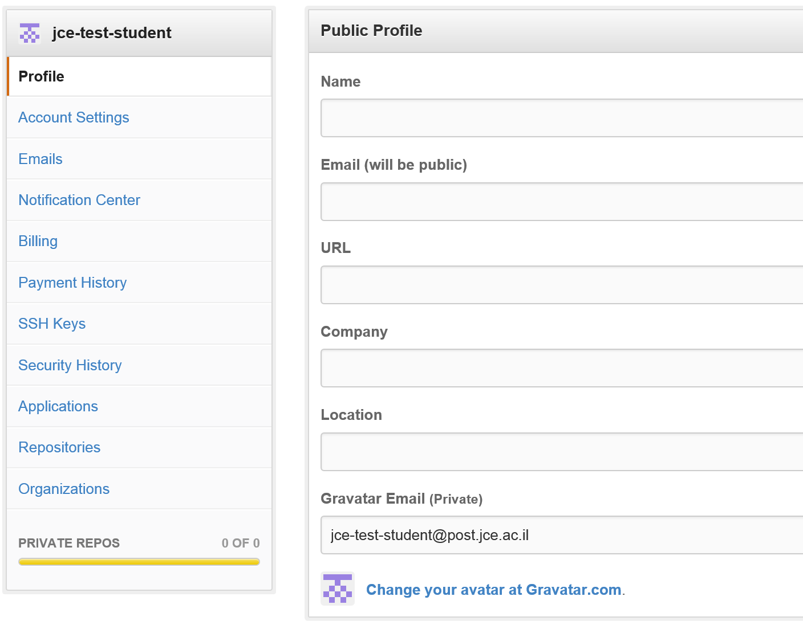

חזרה ל[עמוד ראשי](../../../..)

# שיעורי בית 1 - היכרות עם כלי הפיתוח בקורס והפצה מתמשכת של אפליקציית ווב בסיסית

### מטרות
- רישום והיכרות עם מערכות הקורס
- תיעוד בעזרת ויקי ושפת markdown
- הקמת אפליקציה עם הפצה מתמשכת
- היכרות עם סביבת MEAN Stack

### הרכב הציון
- השלמת המשימה בזמן

### הגשה
- באמצעות קבלת ההזמנה למאגר התרגיל (בהמשך) ועדכונו עד לתאריך ההגשה: 6/03/2017 23:59 (שבוע)

---

##  Git & GitHub

במסגרת הקורס נעשה שימוש במספר שרותים ברשת, בפרט github ישמש אותנו לאחסון גרסאות קוד, ניהול הפרויקט (issues, projects), מסמכים (wiki) וגם תקשורת (chat). גם חומרי הקורס מוגשים דרך שרות זה.

#### רקע

Git היא מערכת בקרת גרסאות קוד (נרחיב בנושא בהמשך הקורס) שפותחה במקור עבור פיתוח מערכת ההפעלה לינוקס.
GitHub הוא שרות git וכן מערכת ניהול פרויקטי תוכנה ועוד בענן. בקורס נשתמש ב- github  בצורה נרחבת.
הערה חשובה: ייתכן ששם המשתמש שתבחרו ילווה אתכם עוד כברת דרך כמהנדסי תוכנה ואפילו משמש כמעין CV בחלק מהמקומות, כך שכדאי לשקול אם אתם מעוניינים להשתמש בכינוי או בשמכם האמיתי - נבקש ששם המשתמש יוכל לזהות אתכם בקלות בינינו למשל ע״י שימוש בשם פרטי ואות ראשונה של שם המשפחה.

(ראו לדוגמא [gh-survey17] עמ' 24, מה בחרו מפתחים שונים)

#### פתיחת חשבון

עליכם לפתוח חשבון ב- github:
לכו לעמוד הבית:

והירשמו לשרות ע"י בחירת שם משתמש, מייל וסיסמא.
בעמוד הבא אין צורך לבחור בתכנית בתשלום... (שמאפשרות למשל פתיחת אתרי פרויקט פרטיים) ורק לאשר את יצירת החשבון. לאחר הרישום אפשר להוסיף פרטים שונים בעמוד החשבון לבחירתכם. 
אתם נדרשים לפחות שתהיה מצורפת תמונה לחשבון שלכם – באמצעות העלאת תמונה או עם שרות חיצוני כמוסבר להלן:
למלא בשדה האחרון מייל שמקושר לתמונה שלכם (באמצעות השרות Gravatar - ברישום נפרד). באופן זה יהיה קל יותר לנהל בהמשך את משימות הפרויקט השונות, ראו בתחתית התמונה: 

- הרשאות למאגרי הקורס: פתחנו קבוצה שיש לה הרשאות למאגרי הקורס - ישמש לתיאום בהמשך הסמסטר. 

<del>נא להיכנס לעמוד הקבוצה ולבקש להצטרף (request to join): [כאן][team]</del> 

עדכון: כרגע האפשרות חסומה, צוות קורס יוסיף אתכם ואם יש צורך נא לשלוח לנו בקשה בצ׳אט (ראו למטה) ונשלח לכם הזמנה להצטרף.

- השרות הוא חינמי למאגרי קוד פתוח. אם תרצו גם לפתוח שם מאגר פרטי אפשר להפנות בקשה כאן: https://education.github.com/discount_requests/new (וגם לקבל תוכנות שונות שהם השיגו עבור סטודנטים).

####  פורום/צ'אט
עכשיו שיש לכם שם משתמש הירשמו בעזרתו גם לחדר הצ'אט/פורום של הקורס (הקישור מופיע בתפריט [ויקי הקורס](course-wiki)) וגם בסילבוס. מומלץ גם להתקין את האפליקציה לנייד או לשולחן עבודה ([Gitter.Apps](https://gitter.im/apps), ועוד בויקי ה[קישורים][web-links]).

הפורום נועד בעיקר לנושאים טכניים הקשורים לקורס, בהמשך תפתחו חדר נפרד עבור הצוות בקורס ויש גם אפשרות לשלוח הודעות פרטיות וישירות בין המשתמשים.

שימו לב לנושאים של [אתיקה ושימוש][using-group-chat] נכון באפשרויות השונות.

:הירשמו לפורום הרלוונטי: [][course-chat]
שלחו הודעת ברוכים הבאים לקורס, צוות הקורס בתמורה יוסיף לכם הרשאות בקבוצת הקורס.

## מאפס לאפליקציית ווב באוויר

כיום מקובלת הפרקטיקה של הפצה מתמשכת (continuous deplyoment) שבה המוצר זמין לאורך הפרויקט בגרסאות מתקדמות בווב.

בתור התחלה נפיץ שלד אפליקציה שמכיל את הרכיבים הבסיסיים של אפליקציית רשת מליאה המכילה: צד שרת, בסיס נתונים וצד לקוח. הקוד יאוחסן בגיטהאב ויסנכרן עם ספק ענן heroku. בדרך כלל מחוללים במחשב מקומי ובודקים לפני ההפצה, אבל אנחנו נשתמש בקוד מוכן ונפיץ אותו ישר.

####  Firebase - פתיחת חשבון

עליכם לפתוח חשבון ב- firebase:
לכו לעמוד הבית:
[firebase][firebase]

והירשמו לשרות.

#### התחלת התרגיל / שכפול הקוד

המשך בקישור [הזמנה לשכפול מאגר תרגיל 1][ex1-repo-invitation].

יש לעקוב אחר ההוראות בעמוד הראשי והמדריך שם.  תצטרכו לבצע עדכון קטן לאפליקציה וכן לעדכן את פרטיכם ופרטי ההפצה בעמוד הראשי.

#### עורך קוד / IDE
[עורך קוד visual studio code][code-editor].

<!-- links -->
[firebase]: https://firebase.google.com/
[code-editor]: https://code.visualstudio.com/
[team]: https://github.com/orgs/jce-il/teams/students2018b
[course-wiki]: https://github.com/jce-il/se-class/wiki
[web-links]:https://github.com/jce-il/se-class/wiki/Links
[using-group-chat]: https://m.signalvnoise.com/is-group-chat-making-you-sweat-744659addf7d#.yur7rp88a
[course-chat]: https://gitter.im/jce-il/se17b
[gh-survey17]: https://github.com/staeiou/github-survey-analysis/blob/master/github_survey_report.pdf
[ex1-repo-invitation]:  https://classroom.github.com/a/SnvdANBp
