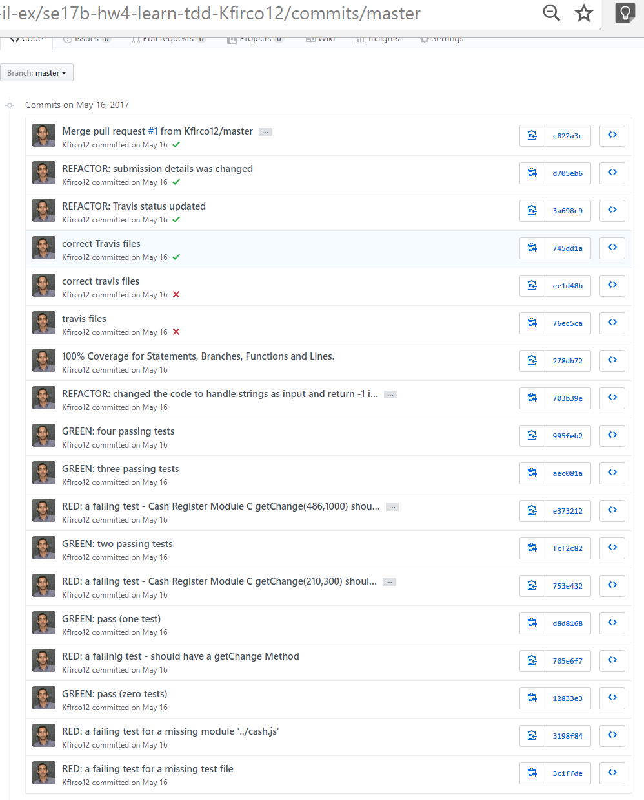

<div dir="rtl">
<div>
</div>

חזרה ל[עמוד ראשי](../../../..)


# לימוד פיתוח מונחה בדיקות (*T*est *D*riven *D*evelopment) ב-js עם ספריית mocha

בתרגיל זה נתנסה בפיתוח מונחה בדיקות, כולל כלי כיסוי קוד ושילוב מתמשך.
כמו כן נרחיב את יכולות בקרת התצורה ע״י כך שנתעד את תהליך ה-TDD באמצעות git וכן נתנסה בשיתוף פעולה באמצעות pull request.

ההגשה באמצעות דחיפת סט השינויים למאגר שלכן.

תאריך הגשה:  שלשה שבועות מהרצאת בדיקות ראשונה: 8/1

## הנחיות מפורטות

- שכפלו את מאגר התרגיל ע״י לחיצה על קישור ה[הזמנה][ex4-invitation].
- עקבו אחרי הנחיות התרגיל ב- README, יש שם גם קישורים להרחבה בנושא בדיקות ו-TDD.
- יש למחוק את תוכן קובץ הבדיקות test/test.js וכן את המימוש ShoppingCart.js ולפתח אותם מחדש כחלק מהתרגיל.
- החל מהשלב בו יש בדיקה (test) שנכשלת, יש לתעד כל שלב בתרגיל ע"י קומיט עם הודעה המתחילה ב: RED:, GREEN:, או REFACTOR: בהתאם לשלב שהתבצע. <br/>למשל: "RED: a failing test for a missing module"
- שלבים הקשורים לתפעול כלים יסומנו עם REFACTOR או TOOL
- לאחר סיום המדריך, יש לתרגל גם בקשת משיכה (pull request), ע"י שכפול (fork) מאגר התרגיל מחשבון הקורס לחשבון הפרטי שלכן, הוספת שינוי נוסף למאגר (למשל בדיקה נוספת, שיפור קוד, שילוב כלי נוסף וכדו') והוספתו למאגר המקומי באמצעות מנגנון זה.
- לסיום יש גם להוסיף בראש קובץ ה- README טבלה עם פרטי התרגיל כדלקמן (שימו לב שהפעם המאגר אינו פרטי, זאת כדי לפשט את העבודה עם השרותים הנוספים).

```markdown
#### Excercise: HW4 - TDD
- Name (or initials):
- github username: 
- Estimation of hours I worked on it: 
```
- הגשה git push

ראו דוגמת הגשה:


-  להלן, מספר התאמות להנחיות:
    - בהנחיות להתקנת הספריה mocha אפשר גם להתקין רק מקומית במאגר, ע"י הורדת הדגל global--.
    - במידה והתקנתם מקומית, הקריאה לספריה היא ע"י המסלול היחסי אליה node_modules/mocha/bin/mocha/.\    - בקריאה לכלי כיסוי הקוד istanbul, יש להתאים בצורה דומה את הקריאה ל- mocha 
    - אפשר גם להוסיף את המסלול לקובץ package.json, בצורה הבאה ואז להריץ עם npm test<br/>

```js
"scripts": { "test": "node node_modules/mocha/bin/mocha" },
```


- כמו כן, יש אפשרות גם לעבוד בזוגות, אם מחלקים את העבודה כך שאחת אחראית על הבדיקות ואחת על המימוש **כולל** בקומיטים - יש לציין את בת הזוג בשורה נוספת בטבלה ההגשה - כל אחת מגישה את העותק שלה.

הערה: מדריך לספריה חליפית https://github.com/dwyl/learn-tape 

<!-- links -->
[ex4-invitation]: <!-- https://classroom.github.com/a/y0k10bIo -->