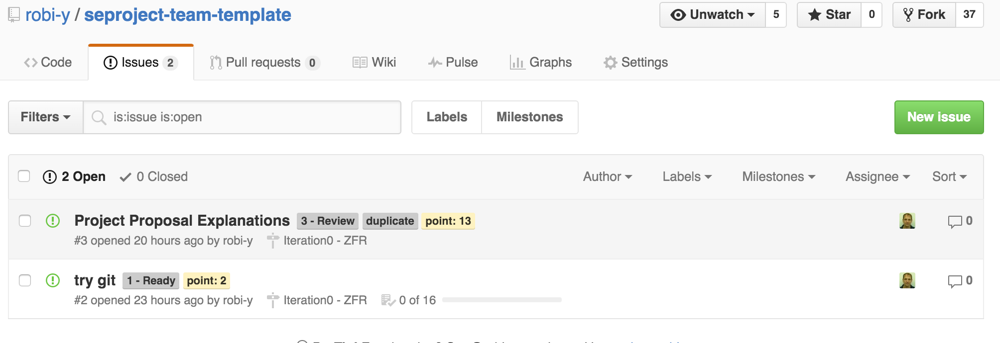

חזרה ל[עמוד ראשי](../../..)

# פרויקט קבוצתי 5 – הקמת תשתיות –ZFR 

## מטרת המשימה
אנחנו מעוניינם בפיתוח איכותי ומבוקר ולכן נדרש ניהול מסודר ומונחה מטרה וכן שימוש בכלי הנדסת תוכנה לניהול הפרויקט ובקרת גרסאות הקוד. 

## פירוט הציון
ראו בהמשך

בנוסף הוחלט שהפיתוח המתאים להמשך הפרויקט הוא פיתוח בסבבים  (ספרינט \ איטרציה).  מסמך זה מגדיר את אופן הפיתוח הנדרש להמשך הפרויקט. המשימות הבאות מחולקות לסבב 0 שבו תכינו את התשתיות להמשך העבודה ועוד מספר סבבי פיתוח עד לסיום הקורס.

סבב 0 נקרא גם לפעמים Zero Feature Release מכיוון שהוא מתמקד בהתארגנות ניהולית ותשתיתית ללא אספקת מאפיינים של המוצר. כל סבב בהמשך ייחשב גם לשחרור ואבן דרך ולכן תמורתו תקבלו כבר תשלום (כנקודות בציון הפרויקט).

בסבב 0 תכינו: 

0. רשימת סיפורי משתמש ממוינת לפי צרכי הלקוח ומחולקת לפי סבבים - במערכת המשימות. 
0. השלמת ההכרות עם כלי הפיתוח הנדרשים, כולל:
  - דיווח על התקדמות עם אב טיפוס
  - תיעוד ראשוני
  - תחילת שימוש במערכת בקרת גרסאות

0. תכנון סבב ראשון בשיטת סקראם. בשאר הסבבים תספקו גרסאות הולכות ומתקדמות של המוצר. לניהול המשימות נשתמש במערכת github/issues ובלוח ויזואלי בשיטת קנבן huboard.com. הקוד יאוחסן כמובן ב-github ע"י שימוש ב-git.

### תאריכים והגשות

- עד לערב ההרצאה הבאה הגשת קישור לעמוד ויקי ZFR שמתאר את מצב אב הטיפוס ומכיל קישורים והפניות לשאר המידע הנדרש להלן.
- רישום בעמוד הפגישות לסקר בזמן ההרצאה (שתי קבוצות פומבי ועוד שתיים בפגישה) ושאר הקבוצות בתרגיל

### ציונים
הניקוד לפי איכות ושלמות ההגשה
חלוקת הציון מפורטת בגליון הציונים לפי עבוד הסבב, מצב המשימות, התיעוד, אב הטיפוס והתכנון לסבב הבא.

## רשימת מאפיינים (סיפורי משתמש) – Product Backlog

### כללי	
 עליכם ליצור רשימת מאפיינים (features) משויכת, מתועדפת ומוערכת. המקורות לרשימה זו הם בעיקר סיפורי המשתמש שהכנתם בשלב הדרישות. ישנן מערכות ייעודיות לניהול דרישות ומאפיינים אך אנו נסתפק ב**הזנת המאפיינים למערכת המשימות של github**.

_הערכה_: כמעט בלתי אפשרי להעריך מאמץ הנדרש למשימה שעוד לא עשינו אף פעם. מצד שני כל מהנדס תוכנה נדרש לתת הערכות. מה עושים? בשלב ראשון מכניסים משימות בסיסיות עם הערכה כללית ויחסית (באמצעות נקודות-סיפור). לפני כל סבב מנסים לחלק למשימות קטנות יותר עד לרמה שעבורה כבר אפשר לתת הערכה גסה לגבי יחסיות הזמן (בשעות) הנדרש לכל משימה. מתעדים את ההערכות שניתנו ומזינים זמני עבודה כדי שבהמשך נוכל לשפר אותן על סמך הניסיון שנרכש בהערכה.

### שלבי העבודה

0. בהסתמך על התכולות שהגדרתם בשלבי הדרישות והתיכון, הצוות מתכנס לתכנן את המשימות ואת קביעת תאריכי הפתיחה והסיום לכל סבב פיתוח. אתם נדרשים לסבב 0 של תכנון והתארגנות באורך של עד שבוע אחד ועוד ארבעה סבבי פיתוח של כשבועיים, כך שתאריך הסיום של הסבב האחרון הוא היום של ההרצאה האחרונה בקורס. הסבבים צריכים להיות באורך קבוע, לפי לו"ז הקורס. המשימות יוזנו במערכת המשימות. 
במקרה שהחלטתם שיש צורך במספר שונה של סבבים, עליכם להתייעץ בנושא עם צוות הקורס ולתעד את תוצאות הדיון בדף הסבב.

0. בהגדרות מאפשרים את מערכת ה- issues (אם טרם בוצע, מצריך הרשאת מנהל), מכניסים אבני דרך - אחת לכל סבב מתוכנן (בתפריט Issues -> כרטיסיית Milestones -> Create a new milestone -> הזנת פרטים: שם משמעותי (למשל Iter0-ZFR, Iter1-XXX-MVP), תיאור ותאריך יעד, ולסיום -> Create). ראו דוגמא גם ב[מאגר התבנית][repo-template]. 
(XXX = שם משמעותי לסבב).

0. בנוסף נעבוד עם לוח ויזואלי שיעזור לראות את מצב המשימות תוך כדי עבודה. נכנסים ל- [https://huboard.com)[huboard), מבצעים כניסה (ע"י הכפתור allow public/private access ומאשרים לגשת לנתוני שלכם ב-github), בפעם הראשונה תתבקשו לאשר הוספת תוויות לניהול הלוח (הלוח מוסיף תוויות לעדכון מצב העבודה על כל משימה). אתם מתבקשים להוסיף קישור ללוח שלכם מעמוד הפרויקטים באתר הקורס. ניתן גם להוסיף דרך github issues תוויות נוספות לפי הצרכים שלכם (Issues -> labels: שם, צבע -> Create)), כגון סוג המשימה: משתמש\מאפיין, באג, שיפור וכדו'. 
יש להוסיף קישור ללוח מעמוד ה- Readme.
 
הערה: אפשר להשתמש במערכת חלופית כדוגמת PivotalTracker, gissues, Assana, Trello, Taiga, Mingle ובלבד שהיא מקושרת לשינויים והמשימות במאגר github שלכם ועונה על הדרישות המפורטות כאן (התייעצו איתנו אם צריך).

0. הצוות מחליט על סיפורים ומשימות בפרויקט (לפי כל מה שהכנתם עד כה, עם דגש על תרחישי שימוש וסיפורי משתמש, אך גם תשתיות והכנות נדרשות הידועות כרגע) ולכל משימה מכניסים אותה למערכת (Issues -> New Issue), עם שם, אחראי (Assignee – במידה וכבר ידוע), שיוך לסבב (Milestone) ותוויות (למשל: דרישה, סיפור משתמש, משימת פיתוח, באג). 
כמו כן לפי הידוע עכשיו יש לסמן למשימה עדיפות והערכת קושי שלה (אפשר להסתפק במערכת פשוטה של 1-3, או לסמן באמצעות תוויות משלכם כמו במאגר התבנית שסיפקנו). טקסט זה גם יכול לשמש אתכם לתיאור תת-משימות ו\או תרחיש בדיקה עבור כל סיפור. ראו [כאן][gfm-issues] איך אפשר להשתמש ב-markdown לסימון פריטים שבוצעו. במאגר לדוגמא יש תבנית שגורמת שבפתיחת כל משימה חדשה מופיע טקסט ברירת מחדל שאותו אפשר להתאים למשימה.

## בקרת גרסאות – Version Control
 במשימה זו עליכם להדגים שהכנסתם כלי בקרת גרסאות לשימוש עבור הפרויקט והוא מכיל כבר שלד של קבצי הפרויקט ולפחות את אב הטיפוס. 
הצעדים הנדרשים:

0. יצירת שלד קוד בסביבת העבודה שלכם והוספתו למערכת בקרת הקוד – git (אם יש לכם רק את אב הטיפוס ואתם לא מתכננים להשתמש בו – העלו אותו בתוך תת-ספריה באופן זמני)
0. אופציה: הוספת תת-ספריה עבור מסמכי הפרויקט (SDF – Software Document Folder) וקבצים נוספים שתנוהל במערכת הגרסאות גם כן.
0. דחיפת הקוד למאגר של הפרויקט ב- github (בשלב ראשוני זה מומלץ להשתמש בלקוח שמפשט את התהליך, למשל eclipse egit,  github-desktop וכדו׳ – ראו עמוד הכלים בויקי הקורס).
הערה: הדרישה להמשך הקורס היא שיהיה תיעוד של מחבר הקוד בכל קומיט, בדרך כלל על יד מי שכתב אותו – ייתכן ניקוד לפי גרף פעילות.

## אב טיפוס
צרפו קישור להפצת אב-הטיפוס שלכם. במידת הצורך פרטו בעמוד ה-ZFR את תכולות אב הטיפוס.

## תיעוד המוצר
 עליכם לעדכן ולהרחיב בוויקי הפרויקט את דפי התיעוד למשתמש (User Manual) ולמפתח (readme.md / development). 
להלן הגדרות למידע שמצופה בד"כ מתיעוד. בשלב זה אין צורך בהכרח בכל הפרטים אלא בגרסאות ראשוניות של דפים אלו.

התיעוד למשתמש צריך לכלול:

- פרטים כללים על המוצר
- כיצד להתקין (אם בכלל) ולהריץ את המוצר
- פרטים ראשוניים על אופן השימוש במוצר.
- כיצד לדווח על באג שמתגלה (למשל כתובת מייל, פתיחת נושא\באג במערכת המשימות וכדו')

תיעוד זה יכול להפוך בהמשך למדריך למשתמש, במידה ואתם כבר מכינים מדריך במסמך נפרד, תנו קישור אליו.
התיעוד למפתח נועד עבור מפתחים חדשים שמצטרפים אליכם לפיתוח, לבדוק אותו או להשתמש בו למוצר אחר. הדף הוא הרחבה של מה שכבר הכנתם בשלב אתחול הפרויקט.
הוא צריך לכלול:

- כיצד להשיג את הקוד (גרסה אחרונה וגם כתובת המאגר – במידה ומנוהלים במקום אחר)
- הערה בדבר רישיון הפרויקט (למשל קוד פתוח BSD עם זכויות מסוימות למכללה) והפניה למסמך רשיון
- פרטים כלליים על מבנה הספריות והקבצים בפרויקט
- כיצד לבנות (להדר) את הפרויקט
- כיצד לבדוק אותו (למשל הרצת חליפת בדיקות) – נראה בהמשך.
- כיצד להכין גרסה חדשה (סוג קובץ ארכיב ומיקומו, מספור גרסאות, איכות נדרשת מגרסת שחרור וכדו')
- כיצד להגיע לרשימת הבאגים וכיצד ניתן לקבל משימה לעבוד על באג.
- בהמשך: קובצי הקוד בפרויקט צריכים לכלול הערות לפי הצורך, לכל קובץ לפחות שורת הסבר מה תפקידו.
.
## סקר ZFR
במשימה זו עליכם להיפגש עם "נציגי הלקוחות" (במקרה זה צוות הקורס, רישום בעמוד הפגישות) ולהציג להם את מוכנותכם ע"י הצגת:

- רשימת הדרישות הכללית (Product Backlog) והלוח הוויזואלי
- התשתית או אב הטיפוס מוכנסת למערכת בקרת גרסאות (אין צורך במימוש שום דרישה פונקציונאלית). אם רלוונטי הצגה קצרה של אב הטיפוס.
- דיווח קצר על התכנון לסבב 1 (להלן)

תוצרי הסקר: יש לעדכן את רשימת המשימות בהתאם לדברים שעלו והוחלטו בסקר וכן תיעוד הממצאים בסקר בעמוד הויקי של סבב.

## תכנון סבב 1
בהגשת סבב 0 תצטרכו כמו בסבבים הבאים גם להגיש תכנון לסבב הבא 1 – (ראו פירוט ב[סעיף 1 של משימת הסבבים - 6][iteration1]). הסבב הראשון יקרא בנוסף לשם שתבחרו גם Minimum Viable Product ובו תדרשו לממש בפעם הראשונה פונקציונליות עיקרית של המערכת שלכם עובדת מקצה לקצה.

<!--links-->
[gfm-issues]: https://github.com/blog/1375-task-lists-in-gfm-issues-pulls-comments
[repo-template]: https://github.com/robi-y/seproject-team-template/issues
[iteration1]: {{ site.baseurl }}/morea/planning/experience-project6-iterations.html#section-4